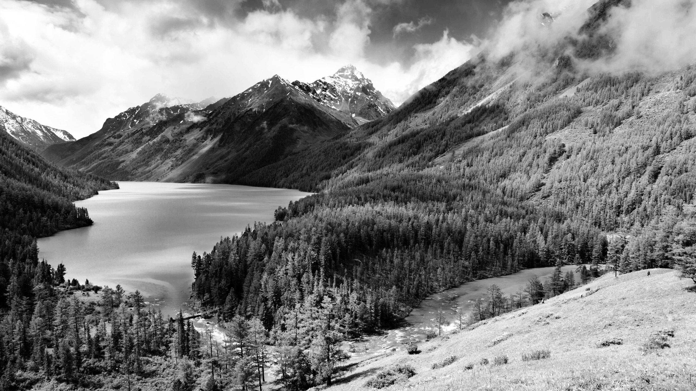
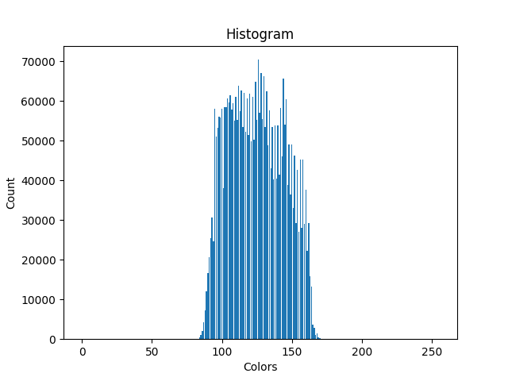
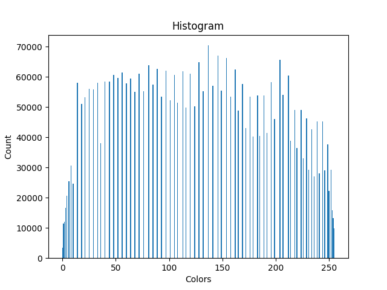
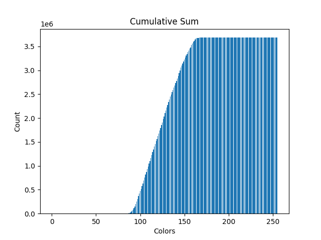
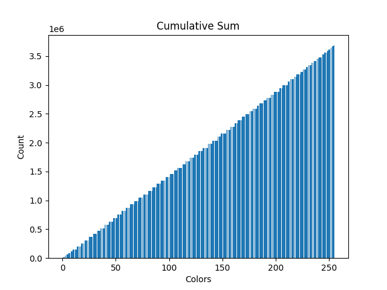

# Histogram Equalization
## Result
### Before

### After

## Histograms
### Before

### After

## Cumulative frequency plots
### Before

### After

## Result for new picture
### Before

### After

### Grayscale

### After
